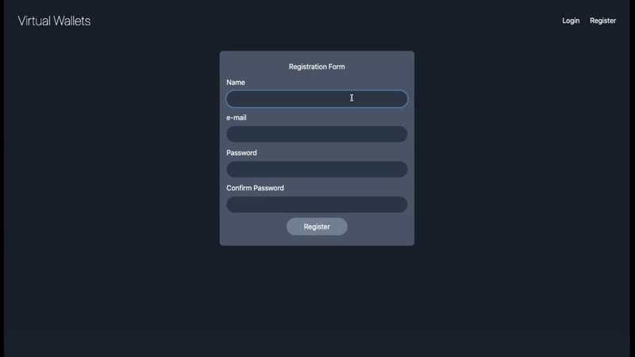

## Virtual Wallets

### Initial Task

Using the Laravel PHP framework, create a basic “virtual wallet” application which satisfies the following user stories.

- As a User, I can sign up for a User account, so that I can access the application.
- As a User, I can login to my account.
- As a User, I can logout of my account.
- As a User, I can create a virtual Wallet.
- As a User, I can view a list of my virtual Wallet.
- As a User, I can rename my virtual Wallet.
- As a User, I can delete a virtual Wallet.
- As a User, I can add a Transaction to a virtual Wallet.
- As a User, I can see all the Transactions in my virtual Wallet.
- As a User, I can delete Transaction from a virtual Wallet.
- As a User, I can mark Transaction as Fraudulent.
- As a User, I see total sum of Transactions in virtual Wallet separated in incoming and outgoing transactions.

### Assumptions

- User can make transactions between User's Wallets.
- On transaction delete, the transaction itself is not reverted.
- On Wallet delete, all associated transactions are deleted as well.

### Worth noting...

- A LiveWire component is being used to make amount change dynamically when changing slider's state.
- Form data is being validated on front-end & back-end.
- Unfortunately no tests were used in this project.

### Full UI's video

https://www.loom.com/share/a722a07999aa478bad2d58e426a95c0e
